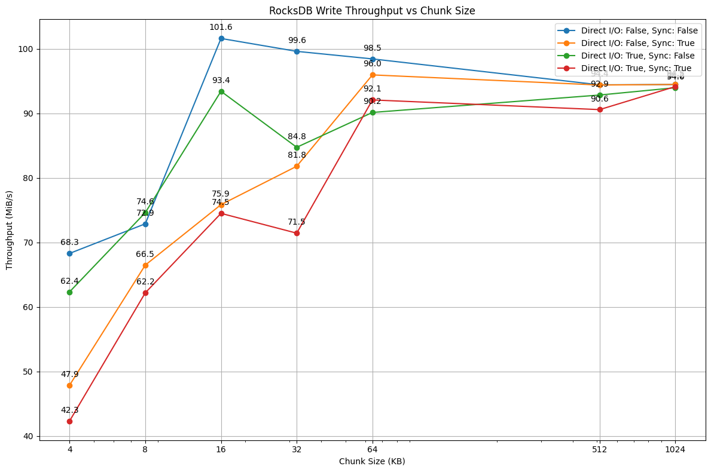

## Benchmark Configuration

The benchmark tests the following configurations:
- Direct I/O: On and Off
- Sync Writes: On and Off
- Chunk Sizes: 4KB, 8KB, 16KB, 32KB, 64KB, 512KB, 1MB

Each combination runs for 1 minute, measuring throughput and latency.

## Results

The benchmark results are visualized in the following graph:

This graph shows the write throughput for different chunk sizes across different configurations of direct I/O and sync writes.
